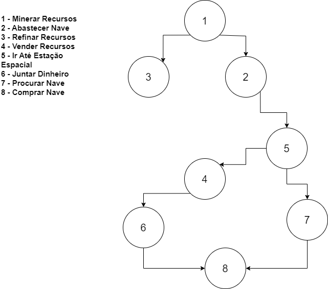

# Implementação De Ordenação Topológica com C

## Sobre o Trabalho: 
No trabalho, foi escolhido um elemento de um jogo e modelado na forma de uma matriz de dependência. Após isso, foi aplicado na mesma o algoritmo de ordenação topológica e imprimida a ordem resultante.

Para esse problema foi escolhido o ciclo de conseguir recursos, vendê-los e comprar uma nave no jogo No Man's Sky. A dependência entre os elementos pode ser descrita como a seguinte árvore:

## Como Rodar:
Para rodar o programa, é necessário ter instalado o .Net (O programa foi testado com a versão 7.0)

abra a pasta do programa no terminal e rode o comando:

    dotnet run
